# GTI Soap Test project 

Project completed under the Operations Technology Development branch of [Gas Technology Institute](hhttps://www.gti.energy/). The title of the project is "Methodology to Estimate Flow Rate of Above Ground Leaks Using a Soap Test". A public version of the project report has been published. 

### Objective 

The objective of the project is to develop a method based on soap test to quickly estimate the flow rate of a natural gas leak on an aboveground component at low pressure (<60 psig). One such component could be natural gas meter sets often located in front of residential buildings.

### Background

Soap test has been used by gas utilities to grade leaks on aboveground facilities. Characteristics of bubbles produced during soap test is used as the basis for distinguishing between hazardous and non-hazardous leaks.

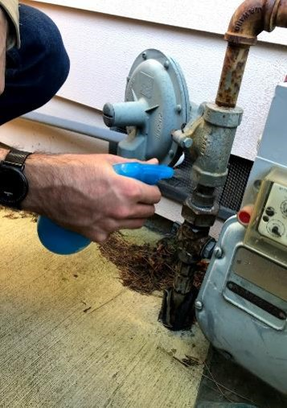

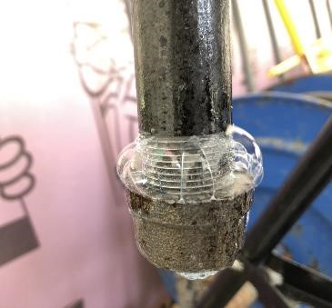

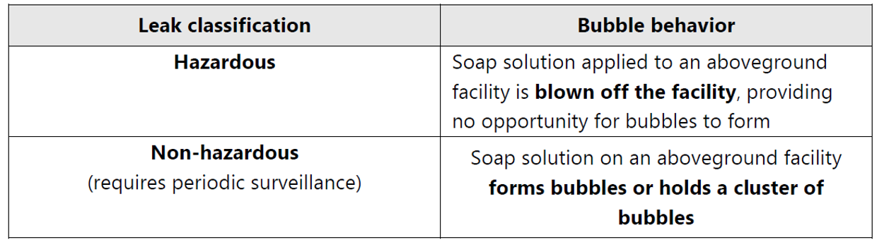

### Metric for classifying soap test

Metric to characterize soap test results have to be simple enough to be used in the field. Some possible metrics include:
1. Bubble size
2. Bubble formation rate
3. Duration before bubble burst
4. Total volume of bubbles

Only bubble size was deemed to be practical as it was relatively simple to keep track of the largest bubble rather than attempting to estimate average size or measure duration using a stopwatch. Thus, bubble size was selected as the metric for characterizing soap test results in the proposed approach.

### Lab testing

Variables used in lab test are:

Leak flow rate was the primary independent variable. We also wanted to determine impact of different soap solutions on bubble characteristics.

Here is the experimental setup for our lab testing:

### Lab test results

Key takeaway from lab testing is that there is a progressive change in bubble behavior as leak flow rate increases. There are 4 distinct phases (i.e. foams, small bubbles, large bubbles, soap solution blown off) which can be used to categorize bubble behavior. 

Soap solution did not affect bubble behavior drastically (chart not shown).

### Field trial

A field trial was performed with a host utility company. A total of 47 residential meter set leaks were visited and each one was tested with the soap test method. The actual leak flow rates of the leaks were also measured for verification purposes. 4 categories were used to classify the results. Based on the bubble characteristics, a category was assigned to each leak.

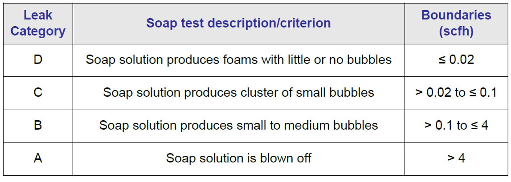

And a tree diagram was used to aid in classifying the results: 

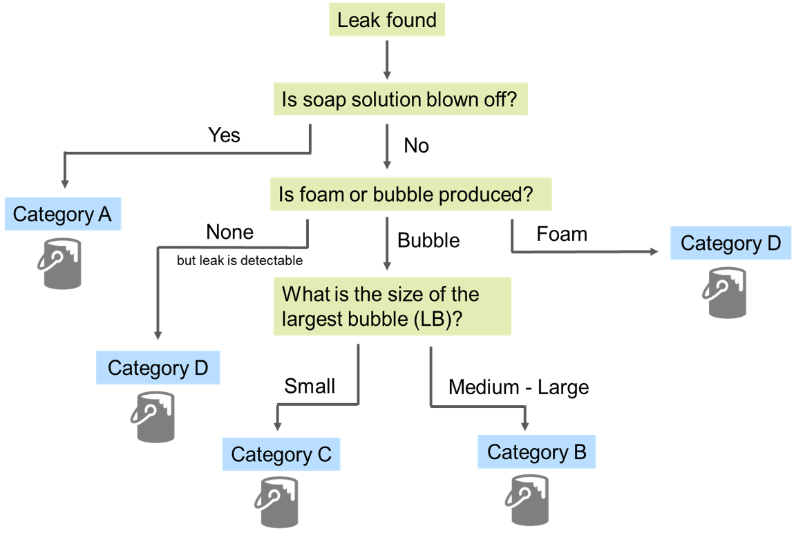

And representative flow rate (emission factor) for each category can be derived using population leak rate distribution simulated using historical regional data. The values of the emission factors are depicted by the green dots on the horizontal axis.

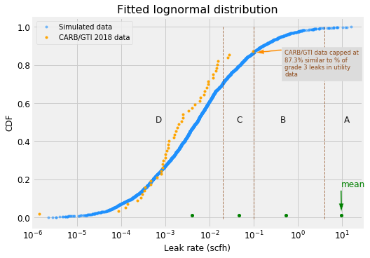

### Field trial results

The distribution of leak rates measured during the field trial followed a long tail distribution and is consistent with findings from other studies:

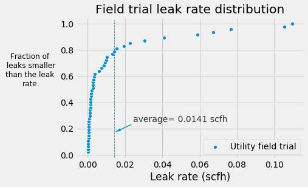

We can then plot the measured leak rate versus categories assigned in the field based on the soap test results. In the scatter plot below, points (individual leaks) in the blue boxes mean that they are correctly assigned where as points below or above the boxes are underestimated/overestimated. 

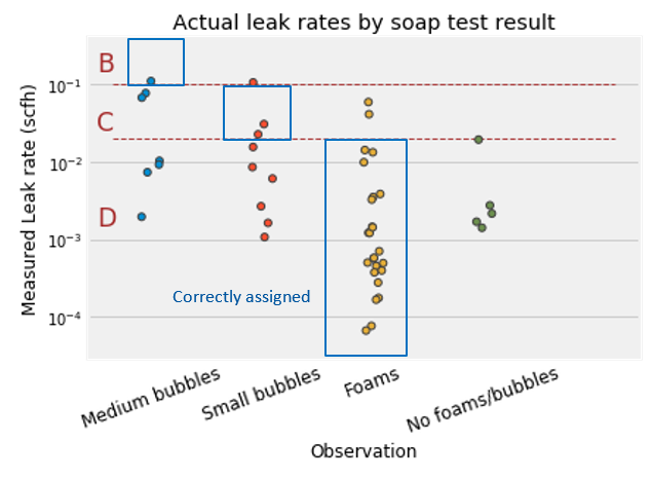

A box plot can be plotted to check how well separated the categories are. Ideally we want good distinction between categories which would allow us to better distinguish small versus large leaks. 

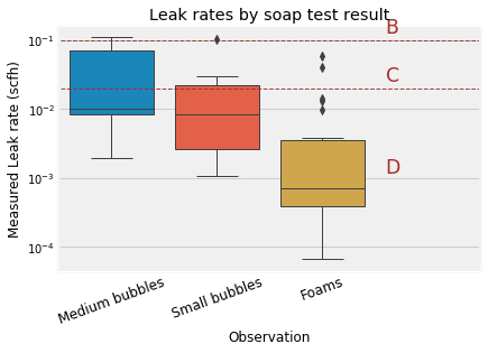

We can change the 4 categories into 3 by combining the middle two categories (B and C) together. Doing so, will help improve the separation between categories:

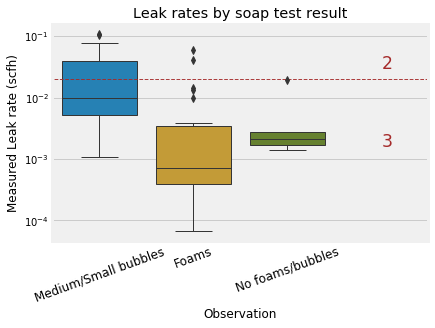

Additionally, we can compare how the estimated leak rates (emission factors) match with actual leak rate:

On a side note, we observed a peculiar phenomenon: in some cases, leaks did not produce bubbles even though we could detect natural gas emissions with methane sensors. We initially hypothesized that these leaks were too small to produce bubbles. However, upon plotting the cumulative distribution of leak rates we found that these "no-bubbles" leaks were NOT the smallest in flow rates. There had to be other factors preventing bubble formation. We will explore this further in future phases. 

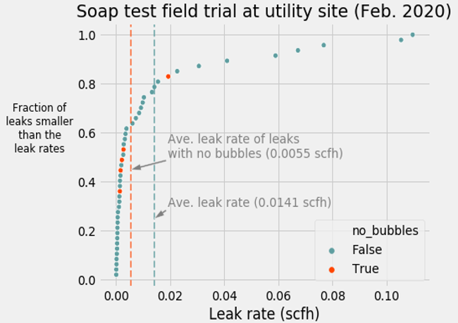

### Method to reduce uncertainty 

We noticed that there could be sources of uncertainty and to minimize uncertainty we can apply a probabilistic method to update the emission factors using fresh new field data. First we analyze the extent of uncertainty in the data using the table below:

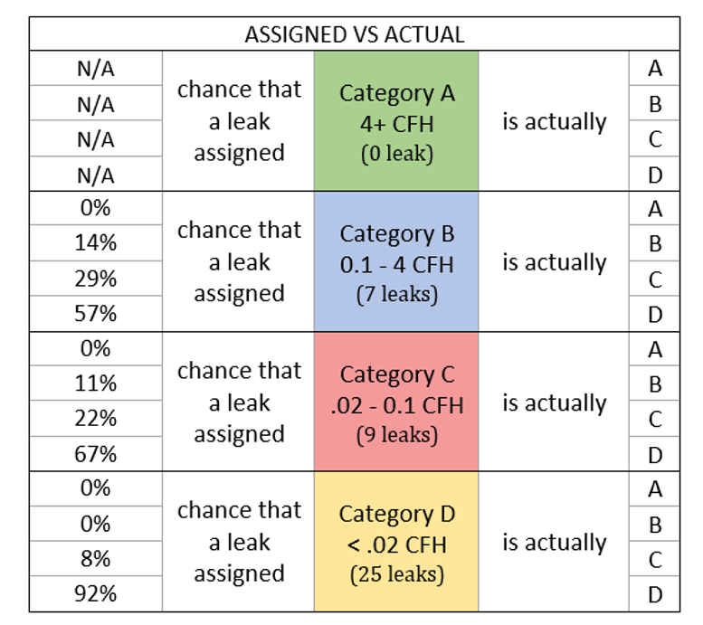

Then based on the true positive and false positive rate for each category, we can correct the emission factor for that group using this formula:

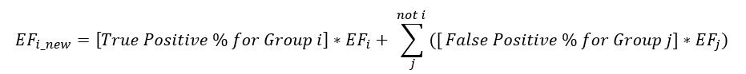

### Steps to develop company-specific leak classification criteria

A utility company interested in implementing the proposed soap test method can employ a 4-step approach to develop their company-specific categories and associated emission factors for characterizing soap test results:

### Credits
The study and report was completed by Gerry Bong, Jarrod Bullen, and Chris Moore. 